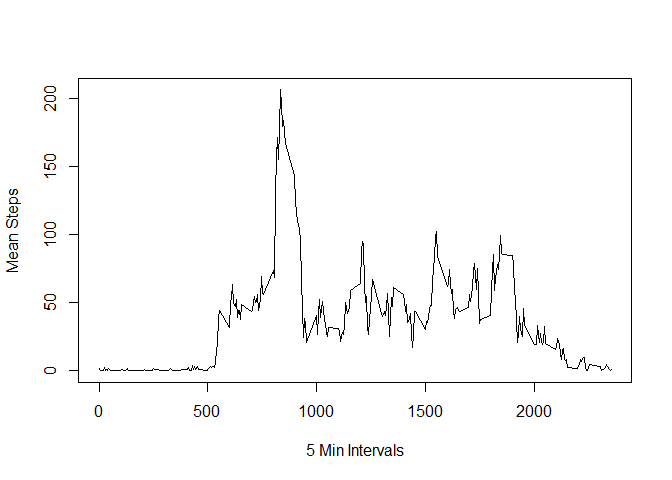

## Loading and preprocessing the data

```r
a_data <- read.csv("D:/surff/Desktop/R Stuff/activity.csv")
a_data$date_format <- as.POSIXlt(a_data$date, format="%Y-%m-%d")
```


## What is mean total number of steps taken per day?

```r
steps <- aggregate(a_data$steps, by=list(date=a_data$date), FUN=sum)
hist(steps$x, xlab = "Steps per Day", breaks = 10)
```

<!-- -->

```r
mean(steps$x, na.rm = TRUE)
```

```
## [1] 10766.19
```

```r
median(steps$x, na.rm = TRUE)
```

```
## [1] 10765
```


## What is the average daily activity pattern?

```r
mean.steps <- aggregate(a_data$steps, by=list(interval=a_data$interval), FUN=mean, na.rm=TRUE)
plot(mean.steps$interval, mean.steps$x, type = "l", xlab="5 Min Intervals", ylab="Mean Steps")
```

<!-- -->

```r
order_steps <- mean.steps[rev(order(mean.steps$x)), ]
order_steps$interval[1]
```

```
## [1] 835
```


## Imputing missing values

```r
#Count number of NAs
sum(is.na(a_data))
```

```
## [1] 2304
```

```r
#replace na with mean
a_data[is.na(a_data)] <- mean.steps$x
na_a_data <- a_data

steps.na <- aggregate(na_a_data$steps, by=list(date=na_a_data$date), FUN=sum)
hist(steps.na$x, xlab = "Steps per Day", breaks = 10, main="Imputed Steps")
```

<!-- -->

```r
mean(steps.na$x)
```

```
## [1] 10766.19
```

```r
median(steps.na$x)
```

```
## [1] 10766.19
```

```r
#The mean is the same as before, but the median is different than before. The new data set has a mean and median that are equal. By imputing missing values using the average number of steps, it makes the mean and median the same value.
```


## Are there differences in activity patterns between weekdays and weekends?

```r
na_a_data$weekdays <- weekdays(na_a_data$date_format)
na_a_data$type <- ifelse(na_a_data$weekdays == "Saturday" | na_a_data$weekdays == "Sunday", "Weekend", "Weekday")

weekend_data <- na_a_data[na_a_data$type == "Weekend", ]
weekday_data <- na_a_data[na_a_data$type == "Weekday", ]
mean.steps.weekend <- aggregate(weekend_data$steps, by=list(Interval=weekend_data$interval), FUN=mean)
mean.steps.weekday <- aggregate(weekday_data$steps, by=list(Interval=weekday_data$interval), FUN=mean)
par(mfrow=c(2,1))
plot(mean.steps.weekend$Interval, mean.steps.weekend$x, type='l', xlab="Interval", ylab="Mean Steps", main="Weekend Data")
plot(mean.steps.weekday$Interval, mean.steps.weekday$x, type='l', xlab="Interval", ylab="Mean Steps", main="Weekday Data")
```

<!-- -->
